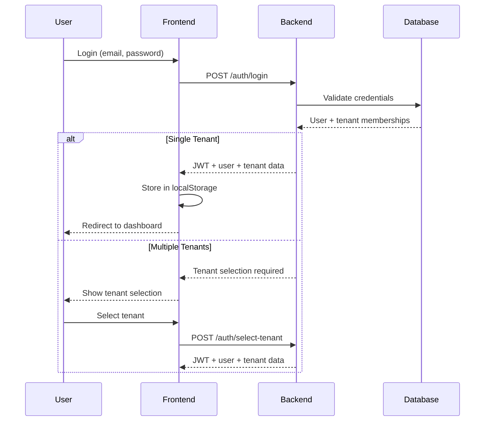
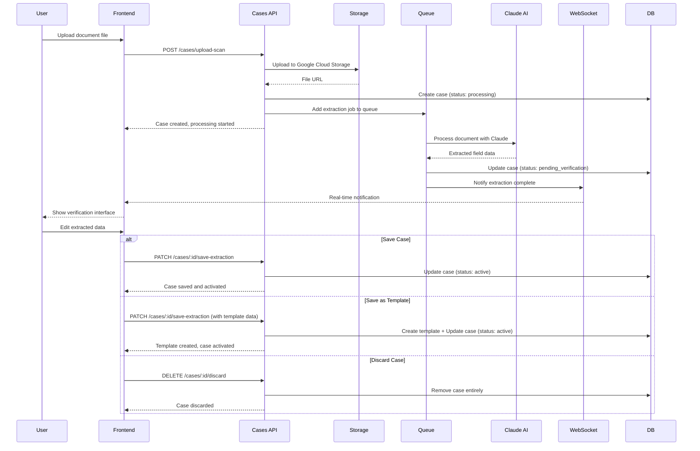
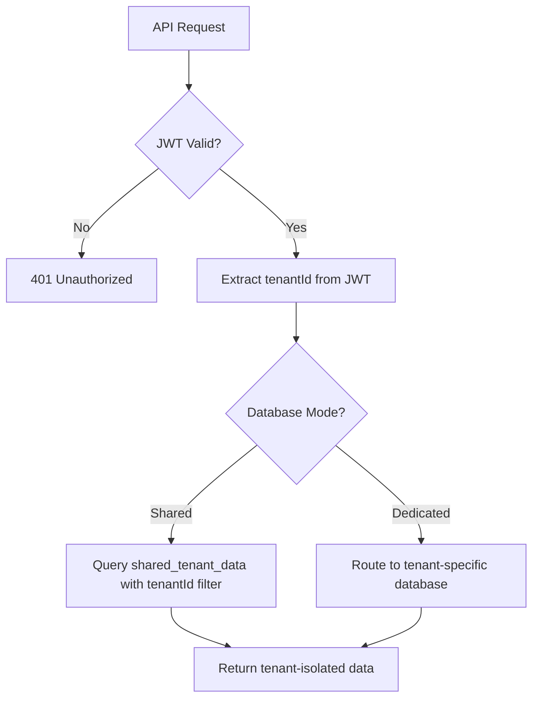

# CozeeDesk System Architecture Documentation

## Table of Contents
1. [System Overview](#system-overview)
2. [Technology Stack](#technology-stack)
3. [Project Structure](#project-structure)
4. [Core Modules and Components](#core-modules-and-components)
5. [Data Flow Diagrams](#data-flow-diagrams)
6. [Database Architecture](#database-architecture)
7. [Authentication & Authorization](#authentication--authorization)
8. [Document Processing Pipeline](#document-processing-pipeline)
9. [Real-time Communication](#real-time-communication)
10. [External Dependencies](#external-dependencies)
11. [Development & Deployment](#development--deployment)

## System Overview

CozeeDesk is a **multi-tenant case management system** with AI-powered document extraction capabilities. The system enables businesses to:

- Manage cases/tickets with structured data
- Upload documents and automatically extract field data using AI
- Create custom templates for different document types
- Process documents in the background with real-time status updates
- Maintain secure tenant isolation

**Key Value Proposition**: Transform manual data entry from scanned documents into automated AI-powered extraction with streamlined editing and template creation.

## Technology Stack

### Backend (cozeedesk-backend)
- **Framework**: NestJS (Node.js with TypeScript)
- **Port**: 3005
- **Database**: MongoDB with multi-tenant architecture
- **Authentication**: JWT tokens
- **Queue System**: Redis + Bull for background processing
- **AI Integration**: Anthropic Claude Vision API
- **File Storage**: Google Cloud Storage
- **Real-time**: Socket.io WebSocket gateway

### Frontend (cozeedesk-frontend)
- **Framework**: Next.js 15 with React 19
- **Styling**: TailwindCSS
- **State Management**: React Context (Auth & WebSocket)
- **Build Tool**: Turbopack for development
- **TypeScript**: Full type safety across the application

## Project Structure

```
cozeedesk/
├── cozeedesk-backend/           # NestJS API server
│   ├── src/
│   │   ├── auth/                # Authentication module
│   │   ├── cases/               # Case management
│   │   ├── templates/           # Document templates
│   │   ├── extraction/          # AI processing pipeline
│   │   ├── storage/             # File storage service
│   │   ├── notifications/       # WebSocket gateway
│   │   ├── database/            # Multi-tenant DB service
│   │   ├── users/               # User management
│   │   └── tenants/             # Tenant management
│   └── package.json
├── cozeedesk-frontend/          # Next.js web application
│   ├── src/
│   │   ├── app/                 # Next.js App Router
│   │   │   ├── (dashboard)/     # Protected dashboard routes
│   │   │   ├── login/           # Authentication pages
│   │   │   └── signup/
│   │   ├── components/          # Reusable UI components
│   │   ├── contexts/            # React Context providers
│   │   ├── types/               # TypeScript definitions
│   │   └── lib/                 # Utility functions
│   └── package.json
└── ARCHITECTURE.md              # This file
```

## Core Modules and Components

### Backend Modules

#### 1. Authentication Module (`src/auth/`)
**Purpose**: Handles user authentication, JWT token generation, and multi-tenant access control.

**Key Dependencies**:
- `@nestjs/jwt` - JWT token handling
- `bcrypt` - Password hashing
- `mongodb` - User data storage

**How it connects**:
- Called by frontend login/signup forms
- Validates tokens for all protected API endpoints
- Integrates with Users and Tenants modules for user data

**Key Files**:
- `auth.controller.ts:16-72` - Login endpoint with tenant selection logic
- `auth.service.ts` - JWT generation and validation
- `guards/jwt-auth.guard.ts` - Protects routes requiring authentication

#### 2. Cases Module (`src/cases/`)
**Purpose**: Core business logic for case/ticket management and document processing workflows.

**Key Dependencies**:
- Storage Service - File upload handling
- Extraction Queue Service - Background AI processing
- Feedback Service - User correction logging

**How it connects**:
- Receives API calls from frontend case management pages
- Triggers document extraction jobs when files are uploaded
- Updates case status based on extraction results

**Key Files**:
- `cases.controller.ts:71-134` - Document upload and extraction initiation  
- `cases.controller.ts:154-224` - Save extraction with user edits and optional template creation
- `cases.controller.ts:230-255` - Discard case functionality (replaces rejection)
- `cases.service.ts` - CRUD operations for cases

#### 3. Extraction Module (`src/extraction/`)
**Purpose**: AI-powered document processing pipeline using Claude Vision API.

**Key Dependencies**:
- `@anthropic-ai/sdk` - Claude AI integration
- `bull` - Background job queue processing
- `sharp` - Image processing and enhancement
- `pdf-to-png-converter` - PDF to image conversion

**How it connects**:
- Triggered by Cases module when documents are uploaded
- Processes files asynchronously in Redis queue
- Sends real-time updates via Notifications module
- Returns extracted data to Cases module for user verification

**Key Services**:
- `ExtractionQueueService` - Manages background jobs
- `ClaudeVisionService` - AI integration for text extraction
- `DocumentProcessorService` - File format handling
- `ImageEnhancementService` - Improves image quality for better OCR

#### 4. Database Module (`src/database/`)
**Purpose**: Multi-tenant database architecture with master/tenant database separation.

**Key Dependencies**:
- `mongodb` - Database driver
- `@nestjs/config` - Environment configuration

**How it connects**:
- Used by all modules requiring data persistence
- Automatically routes queries to correct tenant database
- Maintains tenant isolation and security

**Database Architecture**:
```
Master Database (tenant_master):
├── users           # Global user accounts
├── tenants         # Tenant metadata and configuration
└── tenant_memberships  # User-tenant relationships

Tenant Databases:
├── Shared Mode: shared_tenant_data (for free plans)
└── Dedicated Mode: tenant_specific_db (for paid plans)
    ├── cases       # Tenant's cases
    ├── templates   # Tenant's document templates
    └── extraction_feedback  # AI correction data
```

#### 5. Storage Module (`src/storage/`)
**Purpose**: Google Cloud Storage integration for secure file management.

**Key Dependencies**:
- `@google-cloud/storage` - GCS SDK
- Environment variables for GCS credentials

**How it connects**:
- Called by Cases module for file uploads
- Provides signed URLs for secure file access
- Organizes files by tenant for isolation

#### 6. Notifications Module (`src/notifications/`)
**Purpose**: Real-time WebSocket communication for live status updates.

**Key Dependencies**:
- `@nestjs/websockets` - WebSocket decorators
- `socket.io` - WebSocket implementation

**How it connects**:
- Frontend connects via WebSocket context
- Extraction jobs send progress updates
- Users receive real-time notifications in dashboard

### Frontend Components

#### 1. Authentication Context (`src/contexts/AuthContext.tsx`)
**Purpose**: Global authentication state management and user session handling.

**Key Dependencies**:
- `next/navigation` - Next.js routing
- Local storage for token persistence

**How it connects**:
- Wraps entire application in `layout.tsx:32-36`
- Provides auth state to all dashboard components
- Manages login/logout workflows and token refresh

**Key Features**:
- Multi-tenant user context (user + tenant information)
- Automatic token validation on app load
- Redirect logic for unauthenticated users

#### 2. WebSocket Context (`src/contexts/WebSocketContext.tsx`)
**Purpose**: Real-time communication with backend for extraction notifications.

**Key Dependencies**:
- `socket.io-client` - WebSocket client
- Auth Context for user/tenant information

**How it connects**:
- Establishes connection when user is authenticated
- Joins tenant-specific rooms for isolated notifications
- Provides extraction status updates to dashboard components

**Key Features**:
- Automatic reconnection handling
- Tenant-scoped notification delivery
- Extraction progress tracking

#### 3. Dashboard Layout (`src/app/(dashboard)/layout.tsx`)
**Purpose**: Protected layout wrapper ensuring authentication for dashboard pages.

**Key Dependencies**:
- Auth Context for authentication state
- Sidebar component for navigation

**How it connects**:
- Wraps all dashboard routes (`/dashboard`, `/cases`, `/templates`)
- Enforces authentication before rendering content
- Provides consistent navigation structure

#### 4. Case Management Pages
**Purpose**: User interfaces for creating, viewing, and managing cases.

**Key Features**:
- File upload with drag-and-drop support (`react-dropzone`)
- Real-time extraction status updates
- Simplified verification workflow with editing capabilities

#### 5. CaseVerificationDrawer (Completely Redesigned)
**Purpose**: Streamlined interface for editing AI-extracted data and finalizing cases.

**Key Features**:
- **Side-by-side layout**: Original document view + editable fields
- **Inline editing**: Direct field modification with add/remove capabilities
- **Smart title selection**: Choose case title from extracted fields or enter manually
- **Three-action workflow**:
  - **Save Case**: Activate case with current data
  - **Save as Template**: Create reusable template + activate case
  - **Discard**: Remove case entirely if unusable
- **Visual feedback**: Highlight low-confidence fields from AI extraction
- **Strategic logging**: All user interactions logged for debugging and AI improvement

**Removed Complexity**:
- No more Accept/Reject workflow confusion
- No separate confirmation/rejection dialogs
- No complex correction tracking between states

## Data Flow Diagrams

### 1. User Authentication Flow



### 2. Document Upload & AI Extraction Flow



### 3. Multi-Tenant Data Isolation



## Database Architecture

### Master Database Schema (`tenant_master`)

#### Users Collection
```typescript
{
  _id: ObjectId,
  email: string,
  firstName: string,
  lastName: string,
  passwordHash: string,
  tenantMemberships: [{
    tenantId: ObjectId,
    businessName: string,
    roles: string[],
    joinedAt: Date
  }],
  createdAt: Date,
  updatedAt: Date
}
```

#### Tenants Collection
```typescript
{
  _id: ObjectId,
  businessName: string,
  subdomain: string,
  plan: 'free' | 'paid',
  dbMode: 'shared' | 'dedicated',
  dbName?: string,  // Only for dedicated mode
  ownerId: ObjectId,
  createdAt: Date,
  updatedAt: Date
}
```

### Tenant Database Schema

#### Cases Collection
```typescript
{
  _id: ObjectId,
  tenantId: string,  // For shared mode
  title: string,
  type: string,
  status: 'processing' | 'pending_verification' | 'active',
  paymentStatus?: string,
  createdAt: Date,
  createdBy: string,
  templateId?: ObjectId,
  extractedFields: Record<string, string>,
  originalScanUrl?: string,
  extractionJobId?: string,
  extractionMetadata?: {
    confidence?: string,
    processingTime?: number,
    pagesProcessed?: number,
    extractionNotes?: string,
    lowConfidenceFields?: string[],
    error?: string
  }
}
```

#### Templates Collection
```typescript
{
  _id: ObjectId,
  tenantId: string,  // For shared mode
  name: string,
  type: string,
  extractedFieldKeys: string[],
  titleField?: string,
  createdAt: Date,
  createdBy: string
}
```

## Authentication & Authorization

### JWT Token Structure
```typescript
{
  sub: string,      // User ID
  tenantId: string, // Current tenant context
  roles: string[],  // User roles in this tenant
  iat: number,      // Issued at
  exp: number       // Expiry
}
```

### Security Features
1. **Tenant Isolation**: All API endpoints include tenantId validation
2. **Route Protection**: JWT guards on all authenticated endpoints
3. **Role-Based Access**: Future-ready role system for permission granularity
4. **Token Expiry**: Configurable JWT expiration times
5. **Password Security**: bcrypt hashing with salt rounds

## Document Processing Pipeline

### Phase 1: File Upload & Validation
1. File type validation (PNG, JPG, PDF)
2. Size limits (20MB maximum)
3. Upload to Google Cloud Storage
4. Generate secure file URLs

### Phase 2: Queue Processing
1. Add extraction job to Redis queue
2. Convert PDF to images if necessary
3. Enhance image quality for better OCR
4. Process with Claude Vision API

### Phase 3: AI Extraction
1. Send enhanced images to Claude
2. Use template-aware prompts for structured extraction
3. Handle multi-page documents
4. Generate confidence scores for extracted fields

### Phase 4: User Editing & Saving
1. Present extracted data in editable interface
2. Highlight low-confidence fields for user attention
3. Allow field editing, removal, and addition of custom fields
4. Enable case title selection from extracted fields
5. Provide options to:
   - **Save Case**: Activate case with current data
   - **Save as Template**: Create reusable template + activate case
   - **Discard**: Remove case entirely if extraction is unusable
6. Log user corrections for AI model improvement

## Real-time Communication

### WebSocket Implementation
- **Server**: Socket.io gateway in NestJS
- **Client**: Socket.io client in React
- **Rooms**: Tenant-based isolation for notifications

### Event Types
```typescript
interface ExtractionNotification {
  type: 'extraction_started' | 'extraction_completed' | 'extraction_failed';
  caseId: string;
  jobId: string;
  message: string;
  error?: string;
}
```

### Connection Flow
1. User authenticates and receives JWT
2. Frontend establishes WebSocket connection with JWT
3. Backend validates token and joins user to tenant room
4. Extraction jobs emit events to tenant room
5. All tenant users receive real-time updates

## External Dependencies

### Critical Services
1. **MongoDB**: Primary data storage
   - Required for: All data persistence
   - Fallback: None (critical dependency)

2. **Google Cloud Storage**: File storage
   - Required for: Document uploads and retrieval
   - Configuration: Service account credentials in environment

3. **Anthropic Claude API**: AI document extraction
   - Required for: Automated data extraction
   - Fallback: Manual data entry workflow

4. **Redis**: Queue and caching
   - Required for: Background job processing
   - Fallback: Synchronous processing (not recommended)

### Environment Configuration
**Backend (.env files)**:
```bash
# Database
MONGODB_URI=mongodb://localhost:27017/cozeedesk

# Authentication
JWT_SECRET=your-secret-key
JWT_EXPIRES_IN=7d

# AI Integration
ANTHROPIC_API_KEY=sk-ant-...

# Storage
GOOGLE_CLOUD_PROJECT_ID=your-project
GOOGLE_CLOUD_STORAGE_BUCKET=your-bucket

# Queue
REDIS_HOST=localhost
REDIS_PORT=6379
REDIS_PASSWORD=optional

# Domains
FREE_TENANT_DOMAIN=localhost:3000
PAID_TENANT_DOMAIN=yourdomain.com
```

**Frontend (.env.development)**:
```bash
NEXT_PUBLIC_API_BASE_URL=http://localhost:3005
```

## Development & Deployment

### Development Setup
1. **Backend**: `npm run start:dev` (runs on port 3005)
2. **Frontend**: `npm run dev` (runs on port 3000)
3. **Prerequisites**: MongoDB, Redis running locally

### Build Process
- **Backend**: `npm run build` → NestJS compilation to `/dist`
- **Frontend**: `npm run build` → Next.js static generation

### Key Scripts
```json
{
  "backend": {
    "start:dev": "Hot reload development server",
    "build": "Production build compilation",
    "lint": "ESLint code quality checks",
    "test": "Jest unit testing"
  },
  "frontend": {
    "dev": "Next.js development with Turbopack",
    "build": "Production build with optimization",
    "start": "Production server startup",
    "lint": "ESLint code quality checks"
  }
}
```

### Testing Strategy
- **Unit Tests**: Jest for backend business logic
- **Integration Tests**: API endpoint testing
- **E2E Tests**: User workflow validation (recommended)

---

## Workflow Simplification Benefits (Updated Architecture)

### What Changed in the Document Processing Workflow

**Previous Workflow (Complex)**:
1. Upload → AI Extract → Pending Verification → **Accept OR Reject** → Active/Rejected
2. Accept workflow: Complex corrections tracking, multiple confirmation steps
3. Reject workflow: Reason entry, feedback collection, case remains in rejected state

**New Workflow (Simplified)**:
1. Upload → AI Extract → Pending Verification → **Edit & Choose Action**
2. Three clear actions: **Save**, **Save as Template**, or **Discard**
3. Direct editing with immediate feedback, no intermediate states

### Benefits for Maintenance and User Experience

1. **Reduced Cognitive Load**: 
   - Users see 3 clear actions instead of complex accept/reject logic
   - No confusion about what "reject" vs "accept with corrections" means

2. **Cleaner State Management**:
   - Only 3 case statuses: `processing` → `pending_verification` → `active`
   - No `rejected` state that creates orphaned data
   - Cases are either useful (active) or removed (discarded)

3. **Simplified Codebase**:
   - Removed `ConfirmExtractionDto` and `RejectExtractionDto` complexity
   - Replaced with single `UpdateCaseWithExtractionDto`
   - Fewer API endpoints and less conditional logic

4. **Better Template Integration**:
   - Template creation is now part of the save workflow
   - Users can create templates from any successful extraction
   - No separate template creation steps

5. **Improved Error Handling**:
   - Failed extractions are simply discarded rather than tracked as "rejected"
   - Reduces database bloat from unusable cases
   - Clearer feedback to users about what went wrong

### Code Quality Improvements

- **Strategic Logging**: All user actions logged with `[Component:Function]` format
- **Comprehensive Documentation**: Every function has JSDoc comments explaining purpose
- **Single Responsibility**: Each function handles one specific action (save, discard, edit)
- **Descriptive Naming**: `handleSave()`, `handleDiscard()` vs `handleConfirm()`, `handleReject()`

---

## Maintenance Guidelines

### For Mid-Level Developers

1. **Adding New Features**:
   - Follow existing module patterns (controller → service → database)
   - Ensure tenant isolation in all data operations
   - Add proper TypeScript interfaces
   - Update this documentation

2. **Database Changes**:
   - Consider impact on both shared and dedicated tenant modes
   - Plan migration strategies for existing data
   - Test with multiple tenant scenarios

3. **Security Considerations**:
   - Always validate tenantId from JWT, never trust client input
   - Use proper input validation with `class-validator`
   - Test authentication edge cases

4. **Performance Monitoring**:
   - Monitor Redis queue length for extraction backlogs
   - Watch Claude API usage and rate limits
   - Monitor database query performance across tenants

5. **Simplified Workflow Maintenance**:
   - **Save Issues**: Debug `saveExtraction()` endpoint and `handleSave()` frontend function
   - **Discard Issues**: Check `discardCase()` endpoint and database cleanup
   - **Template Creation**: Verify templates module integration in cases controller
   - **Status Transitions**: Only 3 valid states - ensure no code references 'rejected' status
   - **API Endpoints**: New endpoints are `/save-extraction` (PATCH) and `/discard` (DELETE)

### Deprecated Functionality (Removed)
- `POST /cases/:id/confirm-extraction` - replaced by `PATCH /cases/:id/save-extraction`
- `POST /cases/:id/reject-extraction` - replaced by `DELETE /cases/:id/discard`
- `ConfirmExtractionDto` and `RejectExtractionDto` - replaced by `UpdateCaseWithExtractionDto`
- Case status `'rejected'` - cases are now either active or discarded (deleted)

This simplified architecture provides a more maintainable foundation for multi-tenant case management with AI-powered document processing. The streamlined workflow reduces cognitive load for both users and developers while maintaining all essential functionality.